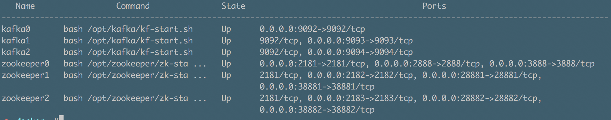
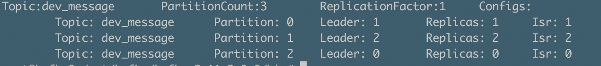
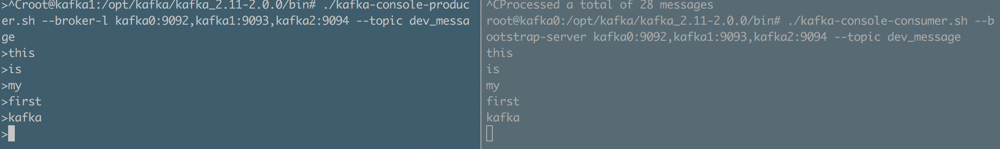

# Docker搭建kafka集群
---

### 参考文档

> [Docker官方文档](https://docs.docker.com/get-started/#recap-and-cheat-sheet)  
>  [Docker中文教程](http://www.runoob.com/docker/docker-command-manual.html)    
> [Sed命令](http://man.linuxde.net/sed)

本文基于docker-compose来搭建kafka集群。

### 编写zookeeper.Dockerfile文件

``` Dockerfile
# zookeeper.Dockerfile

FROM ubuntu:16.04

MAINTAINER Ryan(946065221@qq.com)

RUN apt-get update &&\
    apt-get install -y vim wget

RUN mkdir /opt/java &&\
	wget --no-check-certificate --no-cookies --header "Cookie: oraclelicense=accept-securebackup-cookie" http://download.oracle.com/otn-pub/java/jdk/8u181-b13/96a7b8442fe848ef90c96a2fad6ed6d1/jdk-8u181-linux-x64.tar.gz -P /opt/java &&\
    tar -zxf /opt/java/jdk-8u181-linux-x64.tar.gz -C /opt/java &&\
	rm /opt/java/jdk-8u181-linux-x64.tar.gz &&\
	touch ~/.bash_profile &&\
    echo 'export PATH=$PATH' >> ~/.bash_profile &&\
	sed -i "/^export PATH/i export JAVA_HOME=/opt/java/jdk1.8.0_181" ~/.bash_profile &&\
	sed -i  's/^export PATH.*$/&:\$JAVA_HOME\/bin/g' ~/.bash_profile

ENV ZOOKEEPER_VERSION "3.4.10"

RUN mkdir /opt/zookeeper &&\
	wget http://mirror.bit.edu.cn/apache/zookeeper/zookeeper-$ZOOKEEPER_VERSION/zookeeper-$ZOOKEEPER_VERSION.tar.gz -P /opt/zookeeper &&\
    tar -zxf /opt/zookeeper/zookeeper-$ZOOKEEPER_VERSION.tar.gz -C /opt/zookeeper &&\
	rm /opt/zookeeper/zookeeper-$ZOOKEEPER_VERSION.tar.gz

COPY zk-start.sh /opt/zookeeper

EXPOSE 2181

ENTRYPOINT ["bash", "/opt/zookeeper/zk-start.sh"]

```

### 编写zk-start.sh脚本

``` sh
#!/bin/bash
source ~/.bash_profile
cd /opt/zookeeper/zookeeper-3.4.10
cp conf/zoo_sample.cfg conf/zoo.cfg
sed -i 's/.*dataDir=.*$/dataDir=\/data\/zookeeper/g' conf/zoo.cfg
mkdir -p /logs/zookeeper && sed -i '/.*dataDir=.*$/i dataLogDir=\/logs\/zookeeper' conf/zoo.cfg
[ ! -z $ZOOKEEPER_PORT ] && sed -i 's/.*clientPort=.*$/clientPort='$ZOOKEEPER_PORT'/g' conf/zoo.cfg
[ ! -z $ZOOKEEPER_ID ] && mkdir -p /data/zookeeper && echo $ZOOKEEPER_ID > /data/zookeeper/myid
[ ! -z $ZOOKEEPER_SERVERS ] && array=(${ZOOKEEPER_SERVERS//,/ }) && for server in ${array[@]}; do echo $server >> conf/zoo.cfg; done
bin/zkServer.sh start-foreground
```

对上面的脚本进行简单的说明：
- 首先是下载vim和wget（从指定的URL下载文件）
- 下载jdk，Oracle官网上下载jdk，需要点击accept licence的才能下载，还需要进行用户验证。所以在命令行中添加:
    ```
  --no-check-certificate --no-cookies --header "Cookie: oraclelicense=accept-securebackup-cookie" 
    ```
- 配置java环境变量，由于ubuntu没有~/.bash_profile所以先创建该文件，然后使用了sed -i命令配置环境变量，具体语法在点击参考文档中链接查看。
- 下载zookeeper
- 这里我直接写好shell脚本在cp到docker中
- 暴露端口，设置docker启动时运行的脚本

### 编写kafka.Dockerfile文件

``` Dockerfile
# kafka.Dockerfile

FROM ubuntu:16.04

MAINTAINER Ryan(946065221@qq.com)

RUN apt-get update &&\
    apt-get install -y vim wget

RUN mkdir /opt/java &&\
	wget --no-check-certificate --no-cookies --header "Cookie: oraclelicense=accept-securebackup-cookie" http://download.oracle.com/otn-pub/java/jdk/8u181-b13/96a7b8442fe848ef90c96a2fad6ed6d1/jdk-8u181-linux-x64.tar.gz -P /opt/java &&\
    tar -zxf /opt/java/jdk-8u181-linux-x64.tar.gz -C /opt/java &&\
	rm /opt/java/jdk-8u181-linux-x64.tar.gz &&\
	touch ~/.bash_profile &&\
    echo 'export PATH=$PATH' >> ~/.bash_profile &&\
	sed -i "/^export PATH/i export JAVA_HOME=/opt/java/jdk1.8.0_181" ~/.bash_profile &&\
	sed -i  's/^export PATH.*$/&:\$JAVA_HOME\/bin/g' ~/.bash_profile

ENV KAFKA_VERSION "2.0.0"

RUN mkdir /opt/kafka &&\
	wget http://mirror.bit.edu.cn/apache/kafka/$KAFKA_VERSION/kafka_2.11-$KAFKA_VERSION.tgz -P /opt/kafka &&\
	tar -zxf /opt/kafka/kafka_2.11-$KAFKA_VERSION.tgz -C /opt/kafka/ &&\
	rm /opt/kafka/kafka_2.11-$KAFKA_VERSION.tgz &&\
	sed -i 's/num.partitions.*$/num.partitions=3/g' /opt/kafka/kafka_2.11-$KAFKA_VERSION/config/server.properties

COPY kf-start.sh /opt/kafka

EXPOSE 9092

ENTRYPOINT ["bash", "/opt/kafka/kf-start.sh"]
```

### 编写kf-start.sh脚本

``` sh
#!/bin/bash
source ~/.bash_profile
cd /opt/kafka/kafka_2.11-2.0.0
[ ! -z $ZOOKEEPER_CONNECT ] && sed -i 's/.*zookeeper.connect=.*$/zookeeper.connect='$ZOOKEEPER_CONNECT'/g'  config/server.properties
[ ! -z $BROKER_ID ] && sed -i 's/broker.id=.*$/broker.id='$BROKER_ID'/g'  config/server.properties
[ ! -z $LISTENERS ] && sed -i 's/#listeners=.*$/'$LISTENERS'/g'  config/server.properties
[ ! -z $ADVERTISED_LISTENERS ] && sed -i 's/#advertised.listeners=.*$/'$ADVERTISED_LISTENERS'/g' config/server.properties
bin/kafka-server-start.sh config/server.properties
```

kafka的Dockerfile与zookeeper类似。


### 编写docker-compose.yml文件

``` yml
version: '2.0'
services:
  zookeeper0:
    build:
      context: .
      dockerfile: zookeeper.Dockerfile
    image: ryan/zookeeper:1.0
    container_name: zookeeper0
    hostname: zookeeper0
    ports:
      - "2181:2181"
      - "2888:2888"
      - "3888:3888"
    expose:
      - 2181
      - 2888
      - 3888
    environment:
      ZOOKEEPER_PORT: 2181
      ZOOKEEPER_ID: 0
      ZOOKEEPER_SERVERS: server.0=zookeeper0:2888:3888,server.1=zookeeper1:28881:38881,server.2=zookeeper2:28882:38882

  zookeeper1:
    build:
      context: .
      dockerfile: zookeeper.Dockerfile
    image: ryan/zookeeper:1.0
    container_name: zookeeper1
    hostname: zookeeper1
    ports:
      - "2182:2182"
      - "28881:28881"
      - "38881:38881"
    expose:
      - 2182
      - 28881
      - 38881
    environment:
      ZOOKEEPER_PORT: 2182
      ZOOKEEPER_ID: 1
      ZOOKEEPER_SERVERS: server.0=zookeeper0:2888:3888,server.1=zookeeper1:28881:38881,server.2=zookeeper2:28882:38882

  zookeeper2:
    build:
      context: .
      dockerfile: zookeeper.Dockerfile
    image: ryan/zookeeper:1.0
    container_name: zookeeper2
    hostname: zookeeper2
    ports:
      - "2183:2183"
      - "28882:28882"
      - "38882:38882"
    expose:
      - 2183
      - 28882
      - 38882
    environment:
      ZOOKEEPER_PORT: 2183
      ZOOKEEPER_ID: 2
      ZOOKEEPER_SERVERS: server.0=zookeeper0:2888:3888,server.1=zookeeper1:28881:38881,server.2=zookeeper2:28882:38882

  kafka0:
    build:
      context: .
      dockerfile: kafka.Dockerfile
    image: ryan/kafka:1.0
    container_name: kafka0
    hostname: kafka0
    ports:
      - "9092:9092"
    environment:
      ZOOKEEPER_CONNECT: zookeeper0:2181,zookeeper1:2182,zookeeper2:2183
      BROKER_ID: 0
      LISTENERS: listeners=PLAINTEXT:\/\/kafka0:9092
      ADVERTISED_LISTENERS: advertised.listeners=PLAINTEXT:\/\/kafka0:9092
    volumes:
      - /var/run/docker.sock:/var/run/docker.sock
    depends_on:
        - zookeeper0
        - zookeeper1
        - zookeeper2
    expose:
      - 9092

  kafka1:
    build:
      context: .
      dockerfile: kafka.Dockerfile
    image: ryan/kafka:1.0
    container_name: kafka1
    hostname: kafka1
    ports:
      - "9093:9093"
    environment:
      ZOOKEEPER_CONNECT: zookeeper0:2181,zookeeper1:2182,zookeeper2:2183
      BROKER_ID: 1
      LISTENERS: listeners=PLAINTEXT:\/\/kafka1:9093
      ADVERTISED_LISTENERS: advertised.listeners=PLAINTEXT:\/\/kafka1:9093
    volumes:
      - /var/run/docker.sock:/var/run/docker.sock
    depends_on:
        - zookeeper0
        - zookeeper1
        - zookeeper2
    expose:
      - 9093

  kafka2:
    build:
      context: .
      dockerfile: kafka.Dockerfile
    image: ryan/kafka:1.0
    container_name: kafka2
    hostname: kafka2
    ports:
      - "9094:9094"
    environment:
      ZOOKEEPER_CONNECT: zookeeper0:2181,zookeeper1:2182,zookeeper2:2183
      BROKER_ID: 2
      LISTENERS: listeners=PLAINTEXT:\/\/kafka2:9094
      ADVERTISED_LISTENERS: advertised.listeners=PLAINTEXT:\/\/kafka2:9094
    volumes:
      - /var/run/docker.sock:/var/run/docker.sock
    depends_on:
        - zookeeper0
        - zookeeper1
        - zookeeper2
    expose:
      - 9094
```

### 构建kafka集群并测试

- 确保kafka.Dockerfile、zookeeper.Dockerfile及doker-compose.yml在同一目录下,在docker-compose.yml所在的路径下输入以下命令:  `docker-compose up -d`

  显示以下信息表示构建成功
  ``` sh
  Starting zookeeper0 ... done
  Starting zookeeper1 ... done
  Starting zookeeper2 ... done
  Starting kafka1     ... done
  Starting kafka2     ... done
  Starting kafka0     ... done
  ```

- 输入 `docker-compose ps`查看启动的容器相关信息


- 进入其中一个kafka容器中,创建topic
    - ` docker exec -it kafka0 /bin/bash`

    - `source ~/.bash_profile`

    - `cd /opt/kafka/kafka_2.11-2.0.0/bin`

  - `./kafka-topics.sh --create --zookeeper zookeeper0:2181,zookeeper1:2182,zookeeper2:2183 --partitions 3 --replication-factor 1 --topic dev_message`
  
- 查看topic信息
  - `./kafka-topics.sh --zookeeper zookeeper0:2181,zookeeper1:2182,zookeeper2:2183 --describe --topic dev_message`
  
- 启动一个customer
  - `./kafka-console-consumer.sh --bootstrap-server kafka0:9092,kafka1:9093,kafka2:9094 --topic dev_message`
- 启动一个producer
  - `./kafka-console-producer.sh --broker-list kafka0:9092,kafka1:9093,kafka2:9094 --topic dev_message`
- 进行producer端输入相关信息，在customer查看
  